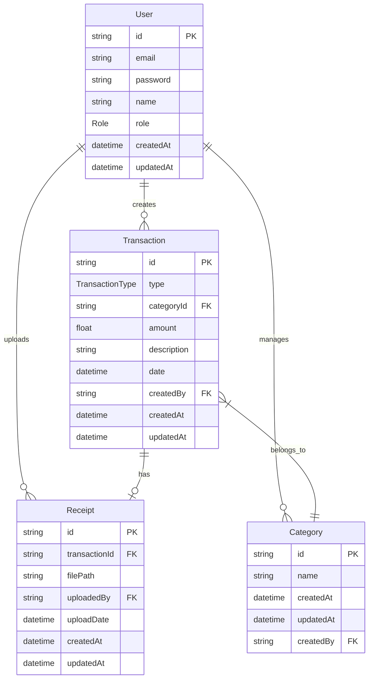

### DBに関する重要なルール
- あなたはDB設計のプロです。
- 常に現状のDB設計に沿って実装をします。
- ORMはPrismaを採用しています。
- schema.prismaは、/prisma内に定義されています。
- schema.prismaを編集、マイグレーションを行った場合は必ず下記に記したER図も更新するようにしてください。
- migrationは必ず

### ER図

以下は各エンティティの主要属性です：
- User: ユーザー管理（ADMIN/VIEWER/ACCOUNTANT）
- Transaction: 取引記録（収入/支出）
- Category: カテゴリ管理
- Receipt: 領収書管理

--