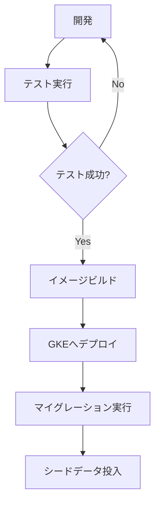

## デプロイ概要

本プロジェクトは、GKE上(開発環境はkind)にk8sアプリケーションとして展開されるマイクロサービスアーキテクチャを採用しています。

### デプロイフロー

このプロジェクトのデプロイフローは以下のように構成されています：

### 重要なファイル

デプロイプロセスを理解・修正する際には、以下のファイルを特に注視する必要があります：

- Dockerfile: コンテナイメージ定義
- k8s/: Kubernetes設定ファイル
- .env.example: 環境変数テンプレート
- prisma/schema.prisma: データベーススキーマ

### 環境変数

デプロイプロセスでは、以下の重要な環境変数が使用されています：

- DATABASE_URL: PostgreSQL接続文字列
- NODE_ENV: 実行環境（development/production）
- PORT: アプリケーションポート

### デプロイ後の処理

デプロイプロセスでは、イメージのビルドとプッシュ後に以下の追加タスクが実行されます：

1. **データベースマイグレーション** (`bun prisma migrate deploy`)
   - Prismaを使用したスキーマ変更の適用

2. **シードデータ投入** (`bun seed:prod`)
   - 本番環境用の初期データ設定

### インフラストラクチャ

### デプロイに関する注意点

### AI支援時のデプロイ作業

AIにデプロイ関連のタスクを依頼する際は、以下の点に注意してください：

AIは必ず上記を精査してから、デプロイ関連のタスクを実行するようにしてください。