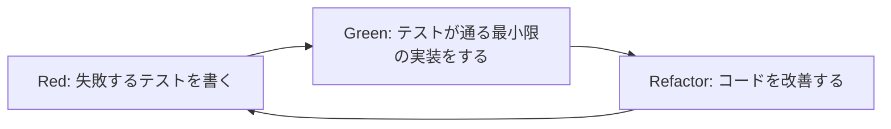
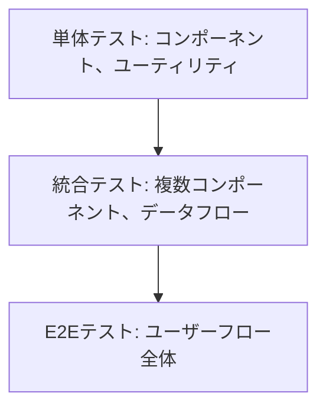
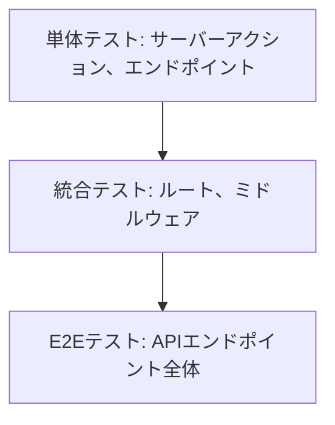

## テスト駆動開発 (TDD) ルール

テスト駆動開発 (Test-Driven Development) は、コードを書く前にテストを書くソフトウェア開発手法です。この方法論を採用することで、設計の質を高め、バグの少ないコードを作成し、リファクタリングを安全に行うことができます。

## TDDの基本サイクル



1. **Red**: まず失敗するテストを書く

   - 必要な機能を明確に定義
   - 期待する振る舞いをテストコードで表現
   - この時点ではテストは失敗する（赤）

2. **Green**: テストが通るように最小限の実装をする

   - テストをパスさせるための最も単純な実装を行う
   - パフォーマンスやコードの美しさより機能性を優先
   - この時点でテストは成功する（緑）

3. **Refactor**: コードをリファクタリングして改善する
   - 重複を排除し、コードを整理
   - 可読性とメンテナンス性を向上
   - テストが依然として通ることを確認

## TDDの重要な考え方

- **テストは仕様である**: テストコードは実装の仕様を表現したもの
- **最初に「何を」考え、次に「どのように」考える**: テストで「何を」達成すべきかを明確にしてから、「どのように」実装するかを考える
- **小さなステップで進める**: 一度に大きな変更を行わず、小さな一歩ずつ進める
- **テストカバレッジより意図のカバレッジを重視**: 単にコードラインをカバーするだけでなく、ビジネスロジックの意図を正確にテストする

## テスト構造の原則

### AAA (Arrange-Act-Assert) パターン

テストコードは以下の3つのセクションで構成することをお勧めします：

1. **Arrange (準備)**: テストの前提条件を設定
2. **Act (実行)**: テスト対象の機能を実行
3. **Assert (検証)**: 期待する結果を検証

```typescript
// Vitest を使用した例
describe('UserService', () => {
  it('should return user by id when user exists', async () => {
    // Arrange
    const mockUser = { id: 1, name: 'John Doe' };
    const userRepositoryMock = {
      findById: vi.fn().mockResolvedValue(mockUser),
    };
    const userService = new UserService(userRepositoryMock);

    // Act
    const result = await userService.getUserById(1);

    // Assert
    expect(result).toEqual(mockUser);
    expect(userRepositoryMock.findById).toHaveBeenCalledWith(1);
  });
});
```

### テスト名の命名規則

良いテスト名は「状況→操作→結果」の形式で記述します：

```typescript
it('有効なユーザーIDが提供された場合_getUserByIdを呼び出すと_ユーザー情報を返すこと', async () => {
  // テスト本体
});

// または英語で
it('should return user information when getUserById is called with valid user ID', async () => {
  // テスト本体
});
```

## フロントエンドとバックエンドのテスト戦略

### SvelteKitフロントエンドのテスト階層



#### 単体テスト (Vitest + Testing Library)

```typescript
// components/Button.test.ts
import { render, screen, fireEvent } from '@testing-library/svelte';
import Button from './Button.svelte';

describe('Button', () => {
  it('renders correctly with text', () => {
    render(Button, { props: { text: 'Click me' } });
    expect(screen.getByText('Click me')).toBeInTheDocument();
  });

  it('calls onClick handler when clicked', async () => {
    const handleClick = vi.fn();
    render(Button, { props: { text: 'Click me', onClick: handleClick } });
    await fireEvent.click(screen.getByText('Click me'));
    expect(handleClick).toHaveBeenCalledTimes(1);
  });
});
```

#### 統合テスト

```typescript
// features/UserProfile.test.ts
import { render, screen, waitFor } from '@testing-library/svelte';
import UserProfile from './UserProfile.svelte';
import { UserProvider } from '../contexts/UserContext';

// モックの設定
vi.mock('../api/user', () => ({
  fetchUserData: vi.fn().mockResolvedValue({ name: 'John Doe', email: 'john@example.com' })
}));

describe('UserProfile', () => {
  it('fetches and displays user data', async () => {
    render(UserProfile, {
      props: { userId: '123' },
      context: new Map([['user', { name: 'John Doe', email: 'john@example.com' }]])
    });

    // ローディング状態の確認
    expect(screen.getByText('Loading...')).toBeInTheDocument();

    // データ取得後の表示確認
    await waitFor(() => {
      expect(screen.getByText('John Doe')).toBeInTheDocument();
      expect(screen.getByText('john@example.com')).toBeInTheDocument();
    });
  });
});
```

#### E2Eテスト (Playwright)

```typescript
// e2e/login.spec.ts
import { test, expect } from '@playwright/test';

test.describe('Login Flow', () => {
  test('allows user to login and redirects to dashboard', async ({ page }) => {
    await page.goto('/login');

    await page.fill('input[name="email"]', 'user@example.com');
    await page.fill('input[name="password"]', 'password123');
    await page.click('button[type="submit"]');

    // ダッシュボードへのリダイレクトと表示確認
    await expect(page).toHaveURL(/.*dashboard/);
    await expect(page.locator('h1')).toContainText('Welcome to your Dashboard');
  });
});
```

### SvelteKitバックエンドのテスト階層



#### 単体テスト (Vitest)

```typescript
// routes/api/users/+server.ts
import { describe, it, expect, vi } from 'vitest';
import { GET } from './+server';
import type { RequestEvent } from '@sveltejs/kit';

describe('GET /api/users', () => {
  it('should return user when user exists', async () => {
    const mockUser = { id: 1, name: 'John Doe' };
    const mockEvent = {
      params: { id: '1' },
      locals: {
        prisma: {
          user: {
            findUnique: vi.fn().mockResolvedValue(mockUser)
          }
        }
      }
    } as unknown as RequestEvent;

    const response = await GET(mockEvent);
    const data = await response.json();

    expect(response.status).toBe(200);
    expect(data).toEqual(mockUser);
  });
});
```

#### 統合テスト

```typescript
// routes/api/users/+server.test.ts
import { describe, it, expect, vi } from 'vitest';
import { app } from '$lib/server/app';
import { prisma } from '$lib/server/prisma';

describe('Users API', () => {
  it('should handle user creation', async () => {
    const mockUser = { name: 'John Doe', email: 'john@example.com' };
    vi.spyOn(prisma.user, 'create').mockResolvedValue({ id: 1, ...mockUser });

    const response = await app.inject({
      method: 'POST',
      url: '/api/users',
      payload: mockUser
    });

    expect(response.statusCode).toBe(201);
    expect(JSON.parse(response.payload)).toHaveProperty('id');
  });
});
```

## 並行テスト実行

大規模なテストスイートでは、テスト実行時間を短縮するために並行実行が有効です。

### Vitestでの並行テスト実行

```typescript
// vitest.config.ts
import { defineConfig } from 'vitest/config';

export default defineConfig({
  test: {
    // CPUコアの50%を使用
    pool: 'threads',
    poolOptions: {
      threads: {
        singleThread: false,
        useAtomics: true,
      },
    },
    // または
    // 固定ワーカー数
    poolOptions: {
      threads: {
        minThreads: 2,
        maxThreads: 4,
      },
    },
  },
});
```

### 並行テスト実行の注意点

1. **テスト間の独立性確保**

   - テストは他のテストに依存しないこと
   - 共有リソース（DBなど）へのアクセスを適切に分離

2. **データ分離**

   - テスト用DBの分離またはトランザクションのロールバック
   - テスト前後のデータクリーンアップ

3. **リソース競合の回避**
   - ファイル操作やポート使用の競合に注意
   - 環境変数の競合回避

```typescript
// マルチテナントDB環境でのテスト分離の例
beforeEach(async () => {
  // テスト用のスキーマを動的に生成
  const schemaName = `test_${Math.random().toString(36).substring(2, 7)}`;
  await prisma.$executeRaw`CREATE SCHEMA IF NOT EXISTS ${schemaName}`;
  await prisma.$executeRaw`SET search_path TO ${schemaName},public`;

  // マイグレーション実行
  await runMigrations(schemaName);

  // このテストのコンテキストにスキーマ名を保存
  testContext.schemaName = schemaName;
});

afterEach(async () => {
  // テスト用スキーマを削除
  await prisma.$executeRaw`DROP SCHEMA IF EXISTS ${testContext.schemaName} CASCADE`;
});
```

## モックとスタブ

### 外部依存のモック化

```typescript
// ユーザーサービスのテスト
describe('UsersService', () => {
  it('should send welcome email when user is created', async () => {
    // EmailServiceのモック
    const emailServiceMock = {
      sendWelcomeEmail: vi.fn().mockResolvedValue(true),
    };

    const usersService = new UsersService(userRepositoryMock, emailServiceMock);

    await usersService.createUser({ name: 'John', email: 'john@example.com' });

    // EmailServiceが正しく呼び出されたか検証
    expect(emailServiceMock.sendWelcomeEmail).toHaveBeenCalledWith('john@example.com', 'John');
  });
});
```

### データベースのモック化

Prismaを使用する場合は、`vitest-mock-extended`を使用して効果的にモックできます：

```typescript
// Prismaクライアントのモック
import { PrismaClient } from '@prisma/client';
import { mockDeep, mockReset, DeepMockProxy } from 'vitest-mock-extended';

vi.mock('@prisma/client', () => ({
  PrismaClient: vi.fn(),
}));

let prisma: DeepMockProxy<PrismaClient>;

beforeEach(() => {
  prisma = mockDeep<PrismaClient>();
  (PrismaClient as unknown as ReturnType<typeof vi.fn>).mockImplementation(() => prisma);
});

test('should create a new user', async () => {
  const mockUser = { id: 1, name: 'John', email: 'john@example.com' };
  prisma.user.create.mockResolvedValue(mockUser);

  const userService = new UserService(prisma);
  const result = await userService.createUser({ name: 'John', email: 'john@example.com' });

  expect(result).toEqual(mockUser);
  expect(prisma.user.create).toHaveBeenCalledWith({
    data: { name: 'John', email: 'john@example.com' },
  });
});
```

## テストリファクタリング

テストコード自体も定期的にリファクタリングすることが大切です：

### DRYなテストコード

```typescript
// テスト前の共通セットアップ
function createUserService(overrides = {}) {
  return new UserService({
    userRepository: { findById: vi.fn(), save: vi.fn() },
    emailService: { sendWelcomeEmail: vi.fn() },
    ...overrides,
  });
}

describe('UserService', () => {
  it('should find user by id', async () => {
    const mockUser = { id: 1, name: 'John' };
    const mockUserRepo = { findById: vi.fn().mockResolvedValue(mockUser) };
    const userService = createUserService({ userRepository: mockUserRepo });

    const result = await userService.findById(1);

    expect(result).toEqual(mockUser);
  });

  // 他のテスト...
});
```

### テストヘルパー関数

```typescript
// テストユーティリティ
function createTestUser(overrides = {}) {
  return {
    id: 1,
    name: 'John Doe',
    email: 'john@example.com',
    isActive: true,
    ...overrides,
  };
}

it('should activate inactive user', async () => {
  const inactiveUser = createTestUser({ isActive: false });
  // ...テストの続き
});
```

## コードカバレッジとレポーティング

### Vitestでのカバレッジ測定

```bash
# カバレッジ測定付きでテスト実行
bun test --coverage
```

```typescript
// vitest.config.ts
import { defineConfig } from 'vitest/config';

export default defineConfig({
  test: {
    coverage: {
      provider: 'v8',
      reporter: ['text', 'json', 'html'],
      thresholds: {
        global: {
          branches: 80,
          functions: 80,
          lines: 80,
          statements: 80
        }
      },
      exclude: [
        'src/**/*.d.ts',
        'src/index.ts',
        'src/**/*.stories.ts',
        'src/**/*.test.ts'
      ]
    }
  }
});
```

## TDDの導入と習慣化

### TDDへの段階的移行

1. **既存コードへのテスト追加から始める**

   - 重要な機能やバグ修正時にまずテストを追加

2. **新機能開発にTDDを適用**

   - 新しい機能開発時にはテストファーストで進める

3. **チーム内でTDDセッションを実施**
   - ペアプログラミングやモブプログラミングでTDDを実践

### GitによるTDDの強化

TDDのサイクルに合わせたコミット戦略：

```bash
# Red: 失敗するテストを書く
git add src/routes/users/+server.test.ts
git commit -m "test: Add test for user activation"

# Green: 実装を行い、テストをパスさせる
git add src/routes/users/+server.ts
git commit -m "feat: Implement user activation"

# Refactor: コードを改善する
git add src/routes/users/+server.ts
git commit -m "refactor: Improve user activation logic"
```

## SvelteKitのテスト設定

### Vitestの設定

```typescript
// vitest.config.ts
import { defineConfig } from 'vitest/config';
import { sveltekit } from '@sveltejs/kit/vite';

export default defineConfig({
  plugins: [sveltekit()],
  test: {
    include: ['src/**/*.{test,spec}.{js,ts}'],
    environment: 'jsdom',
    globals: true,
    setupFiles: ['./src/test/setup.ts'],
    coverage: {
      provider: 'v8',
      reporter: ['text', 'json', 'html'],
    },
  },
});
```

### Playwrightの設定

```typescript
// playwright.config.ts
import type { PlaywrightTestConfig } from '@playwright/test';

const config: PlaywrightTestConfig = {
  webServer: {
    command: 'npm run build && npm run preview',
    port: 4173
  },
  testDir: 'e2e',
  testMatch: /(.+\.)?(test|spec)\.[jt]s/,
};

export default config;
```

## まとめ

テスト駆動開発は単なる手法ではなく、品質を重視する姿勢とフィードバックを素早く得るプロセスです。TDDを習慣化することで：

1. **設計の質向上**: 必要な機能を明確に定義し、クリーンなAPIを設計
2. **バグの削減**: エッジケースやエラー処理を事前に考慮
3. **リファクタリングの安全性確保**: 既存機能を壊さずにコードを改善
4. **開発速度の向上**: 初期は遅く感じても、長期的にはバグ修正時間の削減で効率化
5. **ドキュメントとしての価値**: テストが仕様を示す生きたドキュメントとなる

新たな機能開発や既存コードの修正時には、まずテストから始めることを心がけましょう。