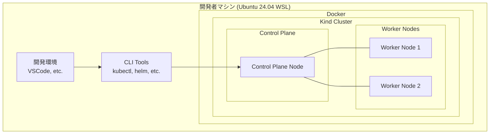
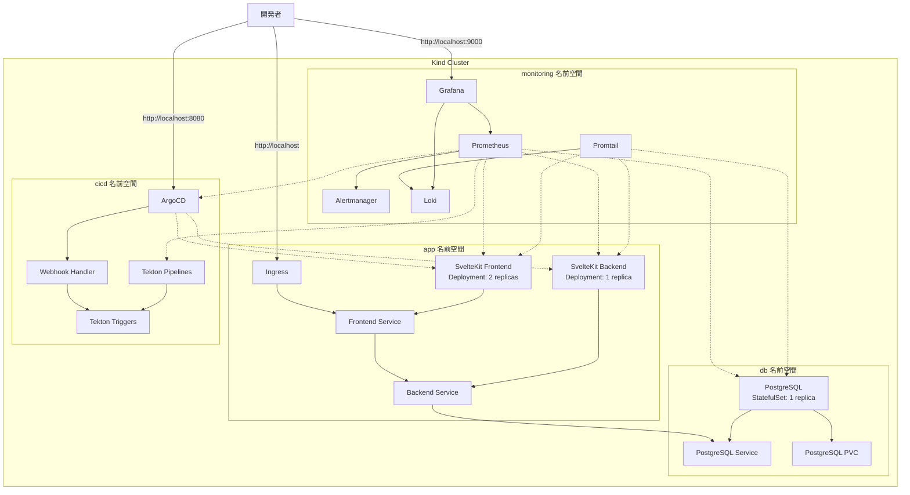

# インフラストラクチャアーキテクチャ

## 全体構成

このドキュメントでは、Kind (Kubernetes in Docker) を使用したローカル WEB システムインフラの構成について説明します。
本構成は SvelteKit をフロントエンド/バックエンドとして、PostgreSQL をデータベースとして使用し、CI/CD パイプラインとモニタリングを統合したものです。

## 物理構成図

## 論理構成図

## コンポーネント詳細

### 1. アプリケーション層

#### SvelteKit Frontend & Backend

- **リソース割り当て**:
  - CPU: 200m (要求) / 500m (上限)
  - メモリ: 256Mi (要求) / 512Mi (上限)
- **スケーリング**:
  - フロントエンド: 2-4 レプリカ (HPA)
  - バックエンド: 1-3 レプリカ (HPA)
- **永続ストレージ**: 不要
- **構成ファイル**: 
  - `k8s/app/frontend-deployment.yaml`
  - `k8s/app/backend-deployment.yaml`

### 2. データ層

#### PostgreSQL

- **リソース割り当て**:
  - CPU: 500m (要求) / 1000m (上限)
  - メモリ: 512Mi (要求) / 1Gi (上限)
- **永続ストレージ**:
  - サイズ: 10Gi
  - ストレージクラス: local-path
- **バックアップ戦略**:
  - スケジュール: 日次
  - 保持期間: 7日間
- **構成ファイル**:
  - `k8s/db/postgresql.yaml`

### 3. CI/CD 層

#### ArgoCD

- **リソース割り当て**:
  - CPU: 300m (要求) / 600m (上限)
  - メモリ: 512Mi (要求) / 1Gi (上限)
- **アクセス**: localhost:8080
- **構成ファイル**:
  - `k8s/cicd/argocd.yaml`

#### Tekton

- **リソース割り当て**:
  - CPU: 200m (要求) / 400m (上限)
  - メモリ: 256Mi (要求) / 512Mi (上限)
- **構成ファイル**:
  - `k8s/cicd/tekton.yaml`

### 4. モニタリング層

#### Prometheus, Grafana, Loki

- **リソース割り当て**:
  - CPU: 500m (要求) / 1000m (上限)
  - メモリ: 1Gi (要求) / 2Gi (上限)
- **永続ストレージ**:
  - Prometheus: 10Gi
  - Loki: 5Gi
- **アクセス**: localhost:9000 (Grafana)
- **構成ファイル**:
  - `k8s/monitoring/kube-prometheus-stack-values.yaml`
  - `k8s/monitoring/loki-stack-values.yaml`

## ネットワーク構成

### 内部ネットワーク

- クラスター内 Pod 間通信: ClusterIP サービス
- 名前空間間通信: NetworkPolicy で制限

### 外部アクセス

- フロントエンドへのアクセス: Ingress (NGINX) を介して
- 管理ツールへのアクセス: ポートフォワーディング
  - ArgoCD: localhost:8080
  - Grafana: localhost:9000

## セキュリティ考慮事項

- **名前空間分離**: 機能ごとに分離
- **リソース制限**: すべてのデプロイメントにリソース制限を設定
- **シークレット管理**: Kubernetes Secrets を使用
- **ネットワークポリシー**: 必要最小限の通信のみ許可

## 運用監視

- **リソースモニタリング**: Prometheus + Grafana
- **ログ集約**: Loki + Promtail
- **アラート**: Alertmanager

## ディザスタリカバリ

- **データベースバックアップ**: 日次バックアップジョブ
- **設定バックアップ**: Git リポジトリでのマニフェスト管理
- **リストア手順**: `scripts/restore.sh`

## 拡張性と移植性

- **環境変数**: 設定値の外部化
- **Helm チャート**: 再利用可能なコンポーネント
- **スクリプト化**: セットアップ自動化

---

## 変更履歴

| 日付 | バージョン | 変更内容 | 変更者 |
|------|-----------|---------|-------|
| 2024-03-25 | 0.1 | 初稿 | AI Assistant | 