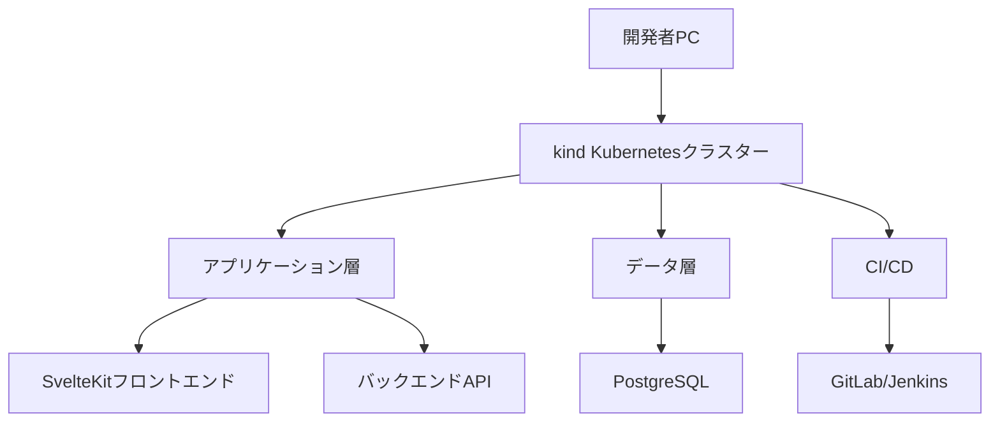

# 要件定義書：ローカルKubernetesインフラ構築

## 文書管理情報

| 項目 | 内容 |
|-----|------|
| 文書名 | ローカルKubernetesインフラ構築要件定義書 |
| バージョン | 1.0.0 |
| 作成日 | 2023年XX月XX日 |
| 最終更新日 | 2023年XX月XX日 |
| 作成者 | プロジェクトチーム |
| 承認者 | - |
| ステータス | ドラフト |

## 改訂履歴

| バージョン | 日付 | 変更内容 | 変更者 |
|----------|------|---------|-------|
| 1.0.0 | 2023年XX月XX日 | 初版作成 | プロジェクトチーム |

## 1. プロジェクト概要

### 1.1 目的
ローカル環境でKubernetes（kind）を活用し、完全に自己完結型の開発・テスト環境を構築する。これにより、クラウドに依存せずに開発を進めつつ、本番環境との一貫性を確保する。

### 1.2 背景
- 新規システム開発にあたり、開発環境から本番環境まで一貫したインフラ構成が必要
- ローカル完結型の環境により、インターネット接続に依存しない開発体制の確立
- 将来的な拡張や他プロジェクトへの流用を視野に入れた設計

## 2. システム要件

### 2.1 全体アーキテクチャ

### 2.2 基本要件

#### 2.2.1 インフラストラクチャ要件
- **ローカル完結性**: 外部クラウドサービスに依存せず、開発マシン上で完全に動作すること
- **Kubernetes基盤**: kindを使用したローカルKubernetesクラスターの構築
- **リソース効率**: 一般的な開発用PCでも快適に動作するリソース設定
- **永続データ**: データベースやファイルストレージの永続化対応
- **ネットワーク**: サービス間通信およびホストからのアクセス設定
- **セキュリティ**: 適切なネットワークポリシーとシークレット管理

#### 2.2.2 アプリケーション要件
- **コンテナ化**: すべてのアプリケーションコンポーネントをコンテナ化
- **マイクロサービスアーキテクチャ**: 機能ごとに分離されたサービス構成
- **スケーラビリティ**: サービスの水平スケーリング対応
- **ヘルスチェック**: 各サービスの健全性監視機能
- **ログ収集**: 集中型ログ収集・分析システム

#### 2.2.3 CI/CD要件
- **自動ビルド**: コードの変更検知と自動ビルドパイプライン
- **自動テスト**: ユニットテスト、統合テスト、E2Eテストの自動実行
- **自動デプロイ**: テスト成功後の自動デプロイメカニズム
- **ロールバック機能**: 問題発生時の自動・手動ロールバック
- **環境分離**: 開発、テスト、ステージング環境の分離

#### 2.2.4 運用監視要件
- **リソースモニタリング**: CPU、メモリ、ディスク使用率の監視
- **アプリケーション監視**: アプリケーションパフォーマンスと可用性の監視
- **アラート**: 閾値超過時の通知機能
- **ダッシュボード**: システム全体の状態可視化

### 2.3 技術スタック

| カテゴリ | 技術 |
|---------|------|
| オーケストレーション | Kubernetes (kind) |
| コンテナランタイム | Docker / Containerd |
| アプリケーション | SvelteKit (フロントエンド/バックエンド) |
| データベース | PostgreSQL |
| ORM | Prisma |
| CI/CD | GitLab CI / Jenkins |
| モニタリング | Prometheus + Grafana |
| ログ管理 | Elasticsearch + Kibana + Fluentd |
| シークレット管理 | Kubernetes Secrets / Vault |
| 開発言語 | TypeScript |

## 3. 詳細要件

### 3.1 Kubernetesクラスター設定

#### 3.1.1 クラスター構成
- マルチノード構成（コントロールプレーン×1、ワーカーノード×2）
- ローカルストレージプロビジョナー設定
- イングレスコントローラー設定
- サービスメッシュ（オプション）

#### 3.1.2 リソース割り当て
- コントロールプレーン: 2CPU, 2GB RAM
- ワーカーノード: 2CPU, 4GB RAM/ノード
- 合計最小要件: 6CPU, 10GB RAM

### 3.2 アプリケーション環境

#### 3.2.1 マイクロサービス構成
- フロントエンドサービス（SvelteKit）
- APIサービス（SvelteKit Server）
- データベースサービス（PostgreSQL）
- 認証サービス（オプション）
- その他業務ドメイン別サービス

#### 3.2.2 デプロイメント設定
- レプリカ数: 各サービス2レプリカ（最小）
- オートスケーリング: CPU使用率70%超過時に自動スケールアウト
- ローリングアップデート: ダウンタイムゼロでの更新
- ヘルスプローブ: Liveness, Readiness, Startup probes設定

### 3.3 データ管理

#### 3.3.1 データベース構成
- PostgreSQLクラスター（StatefulSet）
- PersistentVolume設定による永続化
- バックアップ・リストア機能

#### 3.3.2 データマイグレーション
- Prismaを使用したマイグレーション自動化
- マイグレーションテスト環境の構築
- ロールバック手順の整備

### 3.4 CI/CD パイプライン

#### 3.4.1 ビルドプロセス
- コードリポジトリからのプル
- 依存関係のインストール
- ユニットテスト実行
- コンテナイメージビルド
- イメージスキャン（セキュリティ）

#### 3.4.2 デプロイプロセス
- マニフェストの検証
- 開発環境への自動デプロイ
- テスト環境への手動承認後デプロイ
- 本番環境への手動承認後デプロイ

#### 3.4.3 テスト自動化
- ユニットテスト（Vitest）
- 統合テスト
- E2Eテスト（Playwright）
- パフォーマンステスト

### 3.5 監視・運用

#### 3.5.1 モニタリング設定
- Prometheusによるメトリクス収集
- Grafanaダッシュボード作成
- アラートマネージャー設定

#### 3.5.2 ログ管理
- Fluentdによるログ収集
- Elasticsearchによるログ保存・検索
- Kibanaによるログ可視化

#### 3.5.3 バックアップ戦略
- データベースの定期バックアップ
- 設定ファイルのバックアップ
- 障害復旧手順の整備

## 4. 非機能要件

### 4.1 パフォーマンス要件
- アプリケーションレスポンスタイム: 平均300ms以下
- ページロード時間: 初回1.5秒以内、キャッシュ時500ms以内
- API呼び出しレイテンシ: 200ms以内
- システム全体の最大スループット: 毎秒100リクエスト以上

### 4.2 可用性要件
- システム稼働率: 開発環境でも99%以上
- 計画的ダウンタイム: メンテナンス時のみ
- 障害検知時間: 1分以内
- 障害回復時間: 15分以内

### 4.3 セキュリティ要件
- コンテナイメージの脆弱性スキャン
- ネットワークポリシーによるアクセス制限
- シークレット管理の適切な設定
- 認証・認可メカニズムの実装

### 4.4 拡張性要件
- 新規サービス追加の容易性
- インフラ設定の柔軟な変更対応
- 他プロジェクトへの移植容易性

## 5. セットアップと自動化

### 5.1 環境構築の自動化
- クラスター作成スクリプト
- アプリケーションデプロイスクリプト
- CI/CD設定スクリプト
- 監視設定スクリプト

### 5.2 ドキュメント管理
- インフラ構成図の自動生成
- 設定パラメータの文書化
- 運用手順書の整備
- トラブルシューティングガイド

### 5.3 開発者向けツール
- ローカル環境セットアップコマンド
- 開発ワークフロー支援スクリプト
- デバッグ支援ツール

## 6. 制約条件と前提

### 6.1 技術的制約
- 開発マシンのリソース上限を考慮した設計
- ローカルネットワーク内での完結
- インターネット接続なしでの動作保証

### 6.2 前提条件
- Docker Desktop/Docker Engine導入済み
- 最小ハードウェア要件: 8コアCPU、16GB RAM、100GB空き容量
- OS: Linux, macOS, または WSL2対応のWindows 10/11

## 7. スケジュールとマイルストーン

### フェーズ1: 基盤構築（2週間）
- Kubernetesクラスター構築
- 基本サービスデプロイ
- ストレージ設定

### フェーズ2: アプリケーション環境（3週間）
- マイクロサービスデプロイ
- データベース構築と接続
- 初期アプリケーションデプロイ

### フェーズ3: CI/CD構築（2週間）
- パイプライン構築
- テスト自動化
- デプロイメント自動化

### フェーズ4: 監視・運用体制（2週間）
- モニタリング設定
- ログ収集設定
- アラート設定

### フェーズ5: ドキュメント整備と改善（1週間）
- 設計書最終化
- 運用手順書作成
- 開発者ガイド作成

## 8. 今後の課題と拡張計画

### 8.1 短期課題
- パフォーマンスチューニング
- セキュリティ強化
- デプロイメントの最適化

### 8.2 中長期計画
- マルチクラスター対応
- 本番環境へのスムーズな移行パス確立
- 自動スケーリングの洗練化

## 9. 付録

### 9.1 用語集
- **kind**: Kubernetes IN Docker - ローカルでKubernetesクラスターを実行するためのツール
- **マイクロサービス**: 小さな独立したサービスの集合として設計されたアーキテクチャ
- **StatefulSet**: ステートフルなアプリケーション管理のためのKubernetesリソース
- **イングレス**: Kubernetes内のサービスへの外部アクセスを管理するリソース

### 9.2 参考リソース
- Kubernetes公式ドキュメント
- kind公式ドキュメント
- SvelteKit公式ドキュメント
- Prisma公式ドキュメント

### 9.3 テンプレートとサンプル
- クラスター構成ファイル例
- Kubernetesマニフェスト例
- CI/CD設定ファイル例
- モニタリング設定例 